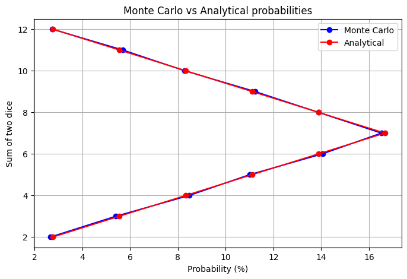

# Task 7 — Monte Carlo Simulation (Dice Rolls)

## Description
This task demonstrates the Monte Carlo method by simulating a large number of rolls of two six-sided dice.  
The goal is to estimate the probability of each possible sum (from 2 to 12) and compare the simulated results with analytical probabilities.

---

## Methodology

### Monte Carlo Simulation
- Two dice are rolled `N` times.
- For each roll, the sum of the dice is calculated.
- The frequency of each sum is counted.
- Probabilities are estimated as percentages.

### Analytical Calculation
- Analytical probabilities are calculated based on all possible outcomes (36 combinations).
- These values represent the exact theoretical probabilities.

---

## Results

### Probability Table
The table below compares Monte Carlo results with analytical probabilities and shows the absolute difference.

| Sum | Monte Carlo (%) | Analytical (%) | Diff (%) |
|-----|----------------|----------------|----------|
| 2   | 2.67           | 2.78           | 0.1068   |
| 3   | 5.41           | 5.56           | 0.1486   |
| 4   | 8.48           | 8.33           | 0.1507   |
| 5   | 11.00          | 11.11          | 0.1071   |
| 6   | 14.06          | 13.89          | 0.1661   |
| 7   | 16.52          | 16.67          | 0.1507   |
| 8   | 13.88          | 13.89          | 0.0059   |
| 9   | 11.24          | 11.11          | 0.1259   |
| 10  | 8.29           | 8.33           | 0.0423   |
| 11  | 5.70           | 5.56           | 0.1414   |
| 12  | 2.76           | 2.78           | 0.0228   |

